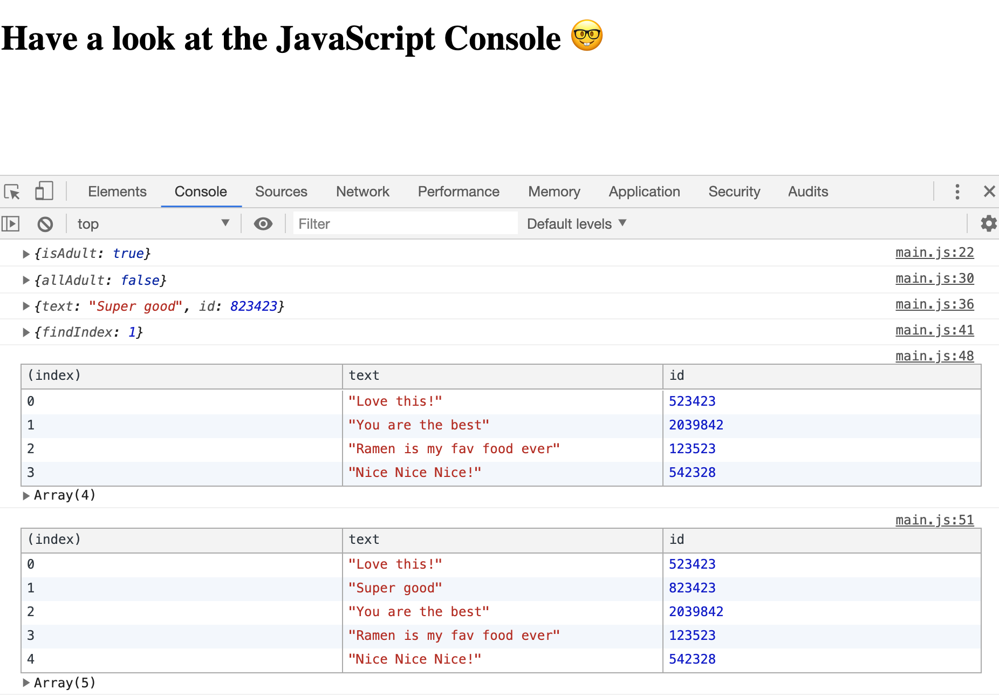

# 07. Array Cardio Day2

#### _Array Cardio Day2 by JavaScript30 10/08/19_

## Description
This is a console demo of array prototype methods, 7th application out of 30 by 30 day Vanilla JavaScript Coding Challenge by Wes Bos.<br>
Please check the challenge from [JavaScript30](http://wesbos.com/javascript30/).




## About Exercises:

1. `.some()` method - returns boolean at least one of the items meets the condition.
2. `.every()` method - returns boolean at every items meet the condition.
3. `.find()` method - find the _first_ item that meets the condition.
4. `.findIndex()` method - return an index number that meets the condition.


## Setup/Installation Requirements

1. Clone this repo:
```
$ git clone https://github.com/misakimichy/JS30-07-array-cardio-day2.git
```

2. Navigate to the top level of the cloned directory.

3. Open `index.html` with your preferred web browser.

4. Open the JavaScript console.

## Known Bugs
* No known bugs at this time.

## Support and contact details
 I welcome any feedbacks and comments: misaki.koonce@gmail.com

## Technologies Used
_Git, GitHub, HTML, CSS, Vanilla JavaScript

## License
Copyright © 2019 under the MIT License